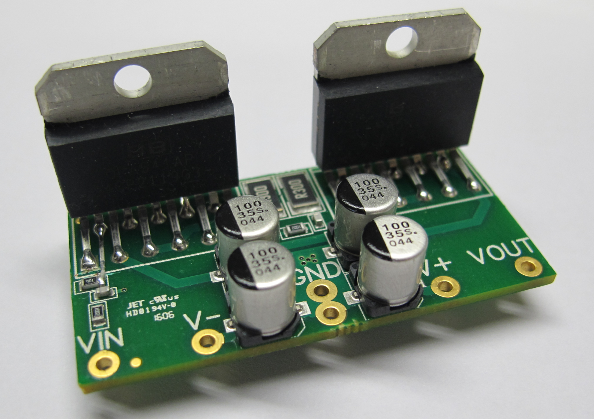
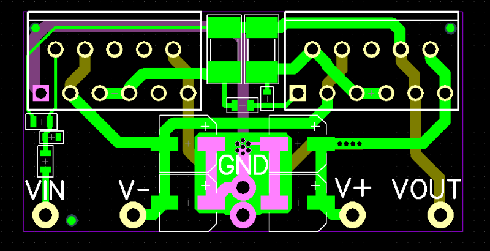
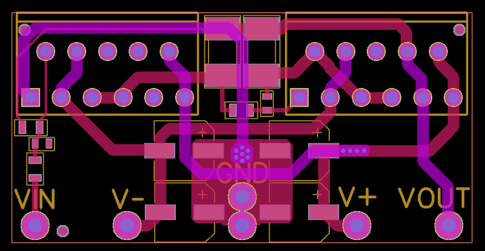

###OPA541AP Breakout
***
**A simple breakout PCB for testing the OPA541 Opamp**

***

***

***

***

Files are for Diptrace 2.4. Gerber files can be found in the Manufacturing Files directory. See main directory for licensing. 