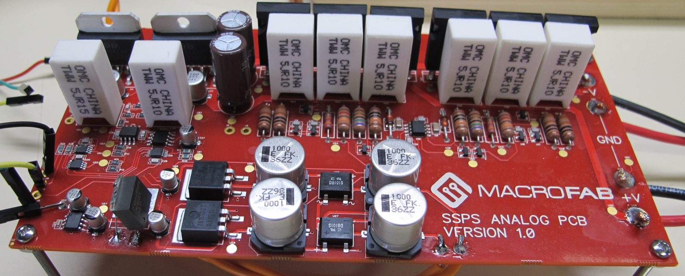
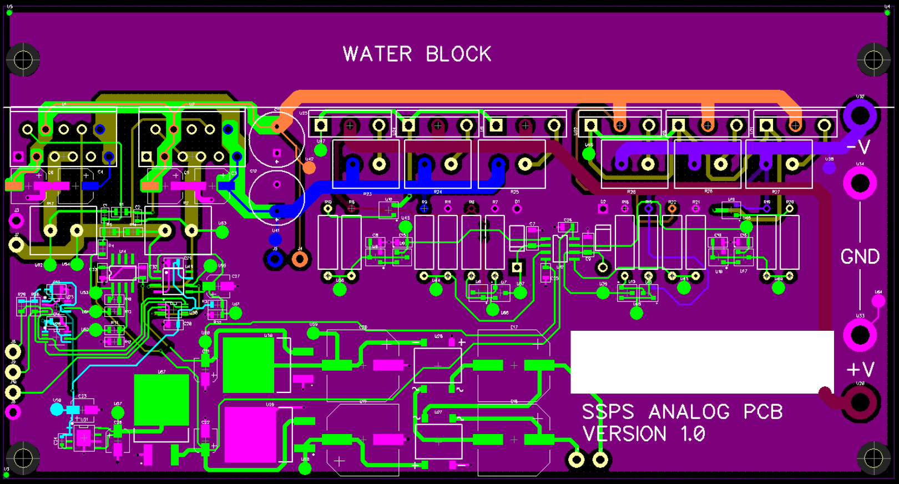
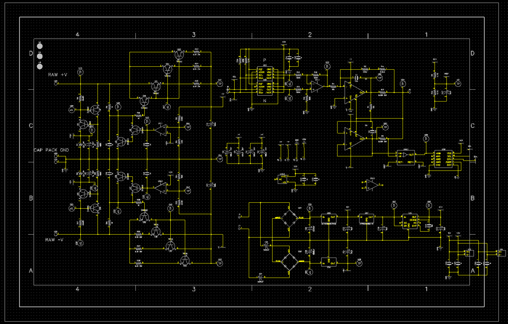
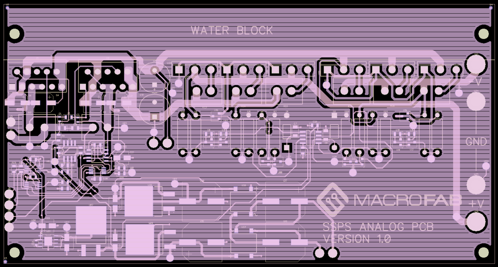

###SSPS Analog Output PCB
***
**The first revision of the analog output PCB for the SSPS**

***

***

***

***

Files are for Diptrace 2.4. Gerber files can be found in the Manufacturing Files directory. See main directory for licensing. 